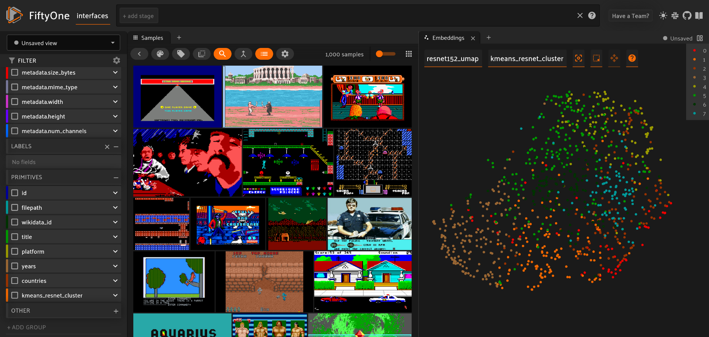
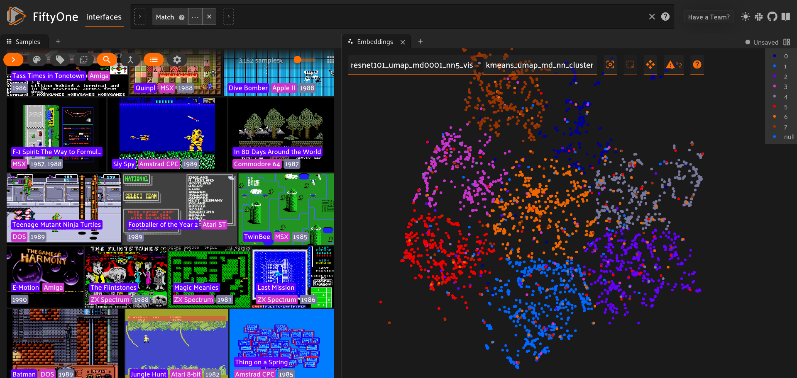

# Video Game History Screenshots Dataset
## Observing the Coming of Age of Video Games' Images

This repository holds a dataset of video game screenshots, scripts aiding in analysing these, and the resulting data from the analysis. The Video Game History Screenshots Dataset (VHS-D) consists of 113'900 in-game screenshots, taken of 4316 video games from 1950-1990.

## Screenshots

## Todos
- [ ] Add genre from Wikidata and/or Mobygames
- [ ] Add metadata on perspective visual presentation from Mobygames
- [ ] Visualize metadata per cluster

## Licence
The VHS-D dataset is made available under the Open Database License: [http://opendatacommons.org/licenses/odbl/1.0/](http://opendatacommons.org/licenses/odbl/1.0/). Any rights in individual contents of the dataset, notable the video game screenshots, are held by their creators and usually covered by fair use. Any rights in the games the screenshots were taken from are held by their developers and publishers, where applicable.
